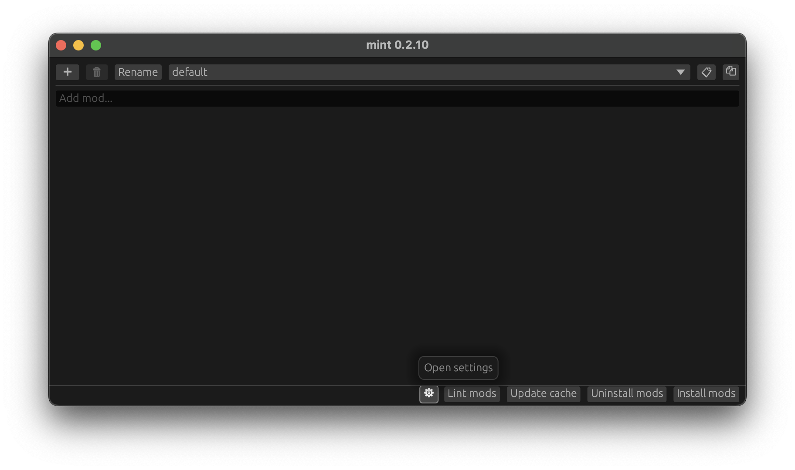
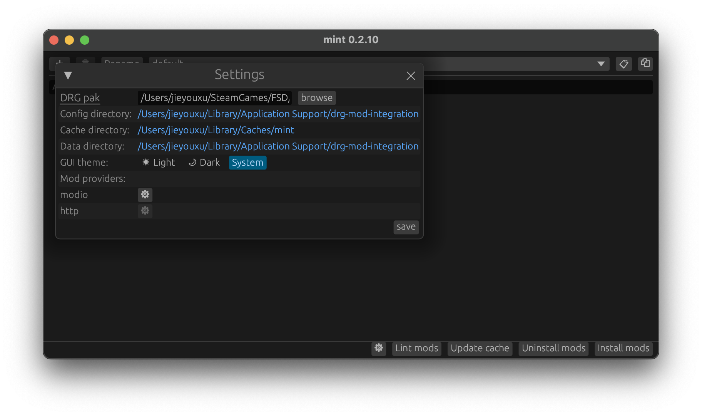
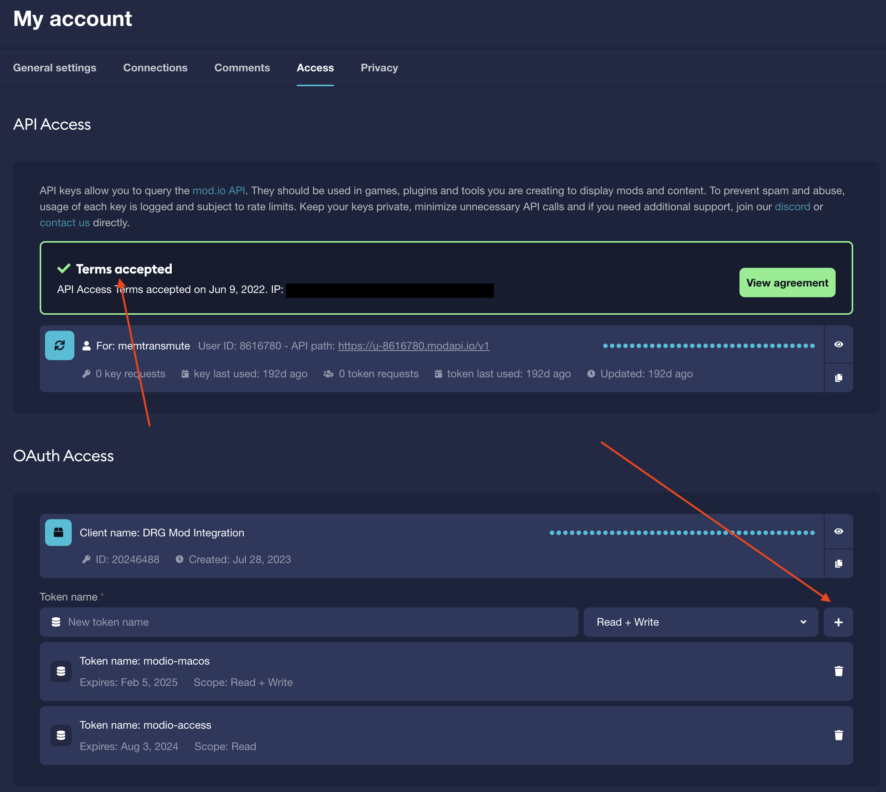
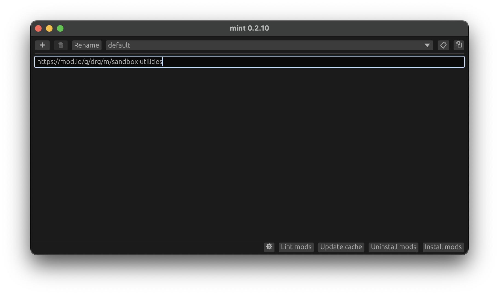
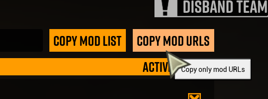
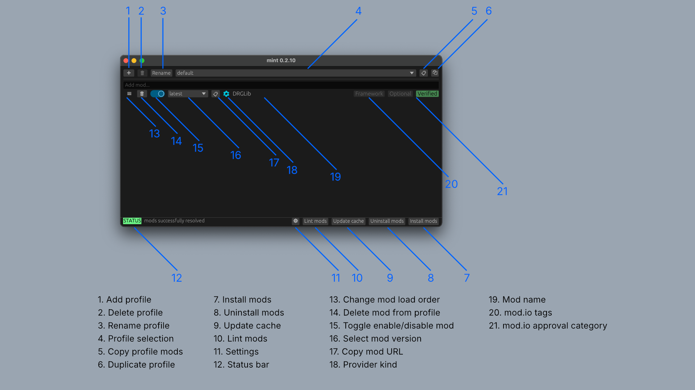
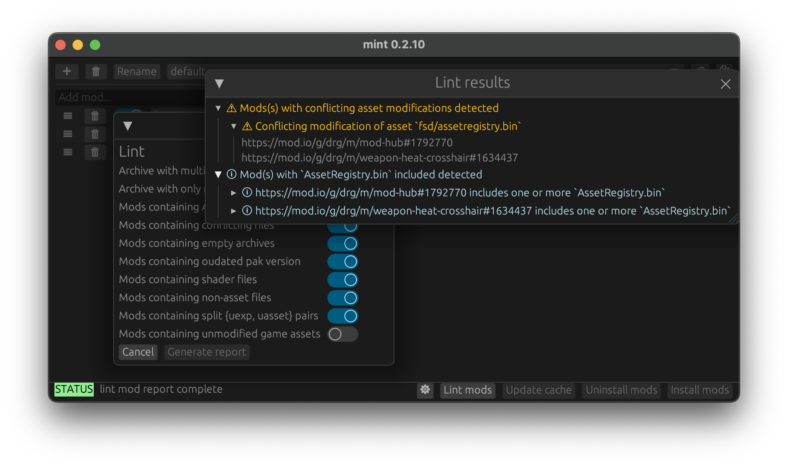

# Mint User Guide

Mint (Deep Rock Galactic *M*od *Int*egrator) is a third-party mod integration tool, currently
primarily for *Deep Rock Galactic*. It works completely externally from the game. Mint allows mods
from mod.io, arbitrary network links as well as local `.pak`s. Mint supports offline mod usage. Mint
works for both Steam and Microsoft Store versions.

[TOC]

## Getting Started

To get started, you will need to download the latest Mint release, and configure settings like
mod.io authorization details and path to the game.

### Downloading the Latest Release

Mint supports both Windows and Linux platforms. You can download the latest version of Mint at
<https://github.com/trumank/mint/releases/latest>.

- For Windows users, download and extract `mint-x86_64-pc-windows-msvc.zip`.
- For Linux users, download and extract `mint-x86_64-unknown-linux-gnu.zip`.

The executable `mint.exe` can be placed anywhere you like.

### Configuring Mint

Upon first usage (or if you deleted the configuration files), you will need to provide some basic
information to Mint.

#### Providing the Path to your Deep Rock Galactic Installation

- Click on the cogwheel (:gear:) located at the bottom of the GUI to open the settings window.

    
    

- You will need to provide the path to your *Deep Rock Galactic* installation. Specifically, you
  need to provide the path to `FSD-WindowsNoEditor.pak` within the *Deep Rock Galactic*
  installation. This is usually found at e.g.
  `C:\Program Files (x86)\Steam\steamapps\common\Deep Rock Galactic\FSD\FSD-WindowsNoEditor.pak` on
  Windows. You should click on the browse button and navigate to
  `<STEAM_LIBRARY_PATH>\Deep Rock Galactic\FSD\FSD-WindowsNoEditor.pak` and select that file.

#### Providing a mod.io Authentication OAuth Token

If you would like to use mods from mod.io, then you will need an *OAuth token* from mod.io. You can
generate a mod.io OAuth token at <https://mod.io/me/access>. You will need to accept the mod.io API
terms and conditions.



- You will need to add a new *client* under OAuth Access. You can call it e.g. "Mint".
- For that client, create a new token with read-only scope. You can call it e.g. "modio-access".
- Copy the generated token into the tool by clicking on the mod.io cogwheel within the
  settings window.

### Adding Mods

After providing the path to your *Deep Rock Galactic* installation and a mod.io OAuth token if you
would like to use mod.io mods, you are now ready to add mods to your current *profile*. A profile
is a collection of mods, and you can switch between profiles to easily change the set of mods that
you would like to use.

Mint supports mods from 3 kinds of sources:

1. mod.io mods: e.g. `https://mod.io/g/drg/m/sandbox-utilities`.
2. Network mods: e.g. `https://example.org/random-mod.pak`.
3. Local mods: e.g. `C:\Downloads\RandomMod.pak`

You can add mod.io and network mods by copying and pasting the mod.io or network link to the mod
into the input field and pressing enter. You can also add a local mod this way by providing the
absolute path to the local mod (e.g. `C:\Downloads\RandomMod.pak`).



For local mods, you can also add them to the current profile by dragging-and-dropping the file from
File Explorer on to the Mint window.

#### Migrating from mod.io

You can make the migration from the official mod integration by:

- Subscribing to the *A Better Modding Menu* mod: <https://mod.io/g/drg/m/a-better-modding-menu>.
- Clicking the "Copy Mod URLs" button in game.

    

This will copy a list of mod.io URLs, and you can paste them into the input field inside Mint and
then press enter.

## GUI Synopsis



- Profile management; need to Install Mods for the selected profile to take effect.
    - (1) Create a new profile
    - (2) Remove a profile
    - (3) Rename a profile
    - (4) Select a profile to become the active profile
    - (5) Copy a list of URLs for the mods in the current profile
    - (6) Duplicate the active profile; this will copy over the whole list as well as the
      enabled/disabled status and the selected mod version for every mod in that profile.
- (7) Install mods. This will install the hook and create a bundle of your enabled mods
  (`mod_P.pak`) next to the `FSD-WindowsNoEditor.pak` within your *Deep Rock Galactic* installation.
  If you toggled a mod's enabled/disabled status, changed a mod's preferred version, changed a
  profile, added/removed a mod from the active profile, etc., then you need to press Install Mods
  again for the changes to take effect. This will also disable the official mod integration system.
- (8) Uninstall mods. This will remove the hook and mod bundle, and reenable the official mod
  integration system.
- (9) Update cache. Mint maintains a *cache* (a snapshot) of your mods' current versions. If a
  mod.io mod has a new version, you will need to press Update Cache to rebuild the snapshot. The
  cache is needed to support offline usage and avoid having to redownload everything every time
  Install Mods is pressed. Need to Install Mods to take effect.
- (10) Lint mods. This opens a window which has a collection of tools to help identify if the
  selection of enabled mods in your profile may have issues, e.g. conflicting mods.
- (11) Settings. This opens a window to configure Mint. It contains inputs to allow the user to
  specify *Deep Rock Galactic* installation path, mod.io access token, select the theme, and so on.
- (12) Status bar. This will report the outcome of a major action such as Install Mods, and report
  errors encountered while trying to perform an action.
- (13) You can drag this handle to re-order mods to change their load order. The top mod is loaded
  last while the bottom mod is loaded first. This means that a mod above overwrites any conflicting
  files it may also modify as mods below it. Need to Install Mods to take effect.
- (14) Remove a mod from the current profile. Need to Install Mods to take effect.
- (15) Enable or disable a mod. Need to Install Mods to take effect.
- (16) Select mod version. You can choose which mod.io mod version to use. It is *strongly*
  recommended that you use the latest version (which is default). Use at own caution.
- (17) Copy mod URL. Copy the URL to the specific mod.
- (18) Indicator for where the mod is sourced from.
- (19) Name of the mod.
- (20) mod.io category labels.
- (21) mod.io approval category. This is verified for non-mod.io mods if they can be auto-verified
  and non-verified otherwise.

## Mod Load Order and Conflict Resolution

Mint's mod load order is *bottom first top last*. This means that a mod will overwrite any
conflicting files that mods below it might also modify.

### Example

If two mods A and B both modify the same files, and they are ordered inside Mint like

- A
- B

Then A will win and overwrite files previously modified by B.

## Mod Lints

*Mod Lints* are a collection of tools that can help to detect *potential* problems such as
compatibility issues (e.g. conflicting files) with the mods in the current profile.




Currently implement lints include (maybe non-exhaustive):

- Archive with multiple paks: an archive may contain more than one mod `.pak`, but Mint will
  only load the first encountered `.pak` within the archive.
- Archive with only non-pak files: an archive does not contain a valid mod `.pak`.
- Mods containing `AssetRegister.bin`: a mod may have `AssetRegister.bin` cooked with it, which
  may indicate potential problems if the mod relies on the `AssetRegister.bin` but other mods also
  modify `AssetRegister.bin`. Note that `AssetRegister.bin` merging and handling is yet to be
  implemented.
- Mods containing conflicting files: two or more mods may modify the same file, and proper load
  order may be required to resolve the conflict, or the mods may need to be fixed, or one or more of
  the mods may need to be removed.
- Mods containing empty archives: a mod may contain an empty archive (the mod does nothing). Helpful
  to detect packaging errors when developing a mod locally.
- Mods containing outdated pak version: a mod may be cooked for an old pak version. May help to
  detect outdated mods or incorrect packaging settings.
- Mods containing shader files: sometimes a mod may contain shader files which can cause issues
  in-game. Also useful for catching incorrect packaging settings when developing mods locally.
- Mods containing non-asset files: a mod may contain non-asset files, which do not affect the game.
  This may be a packaging and/or cooking error.
- Mods containing split `.uexp`/`.uasset` pairs: usually properly cooked assets come in pairs of
  uexp and uasset extensions. Lone uexp or uasset files may indicate incorrect packaging or cooking
  settings.
- Mods containing unmodified game assets: a mod may include unmodified original game assets. This is
  usually a mistake when developing mods. Note that this lint takes a while to run because it has
  to compare original game assets with mod assets.

## Configuration, Mod Data, Cache and Log File

Mint stores the user's configuration, mod data (profiles and its mods) and cache under these
directories on Windows:

- Config and log directory: `C:\Users\<username>\AppData\Roaming\mint\config`.
  Noteable files:
    - Configuration file: `config.json`. **Do not** share this file with another person unless you
      removed the mod.io OAuth token from your mod.io account.
    - Log file: `mint.log`. Please try to include the log file when trying to report
      bugs as it helps us to diagnose the issue.
- Cache directory: `C:\Users\<username>\AppData\Local\mint\cache`. Noteable file:
    - Cache index: `cache.json`.
- Data directory: `C:\Users\<username>\AppData\Roaming\mint\data`.

### Note for users migrating from older versions of mint

Previously, these directories were:

- `C:\Users\<username>\AppData\Roaming\drg-mod-integration\config`
- `C:\Users\<username>\AppData\Local\drg-mod-integration\cache`
- `C:\Users\<username>\AppData\Roaming\drg-mod-integration\data`

## Common Errors and Troubleshooting

### Mod Compatibility Issues

Some mods may work under official mod integration but not in mint. This can be because:

- Official mod integration does not load all the files in a mod, but Mint does. Additionally
  loaded files may cause issues in game.
    - May require the mod to be updated to remove extra files.
- The mod interacts with `AssetRegister.bin`. The official mod integration partially handles
  `AssetRegister.bin` merging, but Mint currently does not implement it.

### Failure While Updating Cache (403, 404)

You may see the following message

```
ERROR mint::gui::message: modio::Error {
    kind: Status(
        403,
    ),
    source: Error {
        code: 403,
        error_ref: 15024,
        message: "The mod ID you have included in your request could not be found.",
        errors: None,
    },
}
```

when trying to update your cache. One of your mod.io mods may be renamed or deleted by its author.
This is currently a bug in Mint that the cache update might get stuck on 403/404 if there is a mod
which got renamed or deleted. The workaround is to:

- Remove the renamed/deleted mod.io mod.
- Remove the cache directory: delete `C:\Users\<username>\AppData\Local\drg-mod-integration\cache`.
- Press Install Mods again.

### Install mods failed with "An existing connection was forcibly closed by the remote host" (OS error 10054)

This can be due to strange mod.io rate limit or network issues. Try waiting for a few minutes and
then try installing mods again.

## Frequently Asked Questions (FAQs)

### Why Does mod XXX not work?

See Mod Compatibility Issues under Common Errors and Troubleshooting.

### What are Mod Lints?

Mod Lints are a set of tools designed to help find potential problems in the mods of the current
profile. These problems can include conflicting files, mods containing unmodified game assets, etc.
Mod Lints can be especially helpful when developing, packaging and cooking mods locally.

### Can Mint be displayed in other languages?

Right now, unfortunately we don't have a good way to do localization. If we could, Mint would likely
come with Simplified Chinese as well as potentially other community-contributed localizations.

### Is there an active mod limit?

Unlike the official mod integration, Mint does not impose mod limits.

### Why does it say modding disabled due to launch options

Mint disables the official mod integration system when you click Install Mods. To restore the
official mod integration system, you will need to click Uninstall Mods.

### Will mod XXX work for clients?

This depends on the particular mod. For `RequiredByAll` mods, it is strongly recommended that every
member of the lobby has the mod installed to prevent desync. For example, clients need to install
Custom Difficulty if the resupply nitra cost is modified or else they cannot call a cheaper resupply
without the default 80 nitra in the team repository.

### Does Mint disable achievements?

Mint does not attempt to disable achievements, regardless of the approval categories of the mods
being used.

### Does Mint force a sandbox save?

Mint does not attempt to force a sandbox save. If you use gameplay affecting mods, it is your
judgement on if it is acceptable to affect the normal saves. It is also recommended to make a
backup of your normal saves (even without Mint, this is a good idea).

### What's the black console showing up when mint launched?

This console window is used for logging and debugging purposes, to help us diagnose errors that you
run into while using Mint.

### Where do I add mods?

See the Adding Mods section under Getting Started.

### Why does Mint add `[MODDED]` tag to my lobby name?

We do not want clients to unknowingly join lobbies that have gameplay affecting mods. If your
profile contain any non-verified mods, your lobby name will have `[MODDED]` prepended to it to
inform potential players who might want to join your lobby.

### Why is mod XXX still active after I disable it?

You need to click Install Mods after making changes to the current profile for changes to take
effect.
